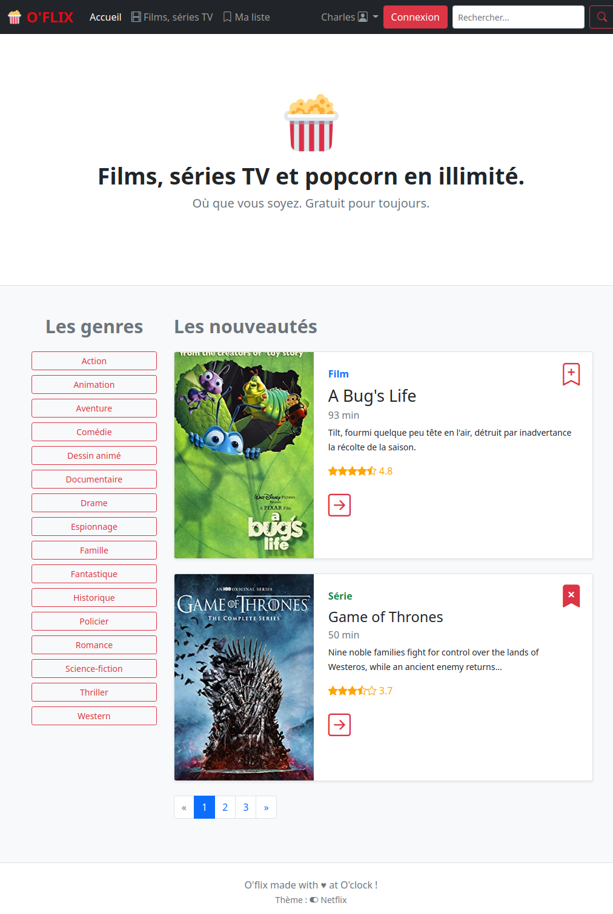
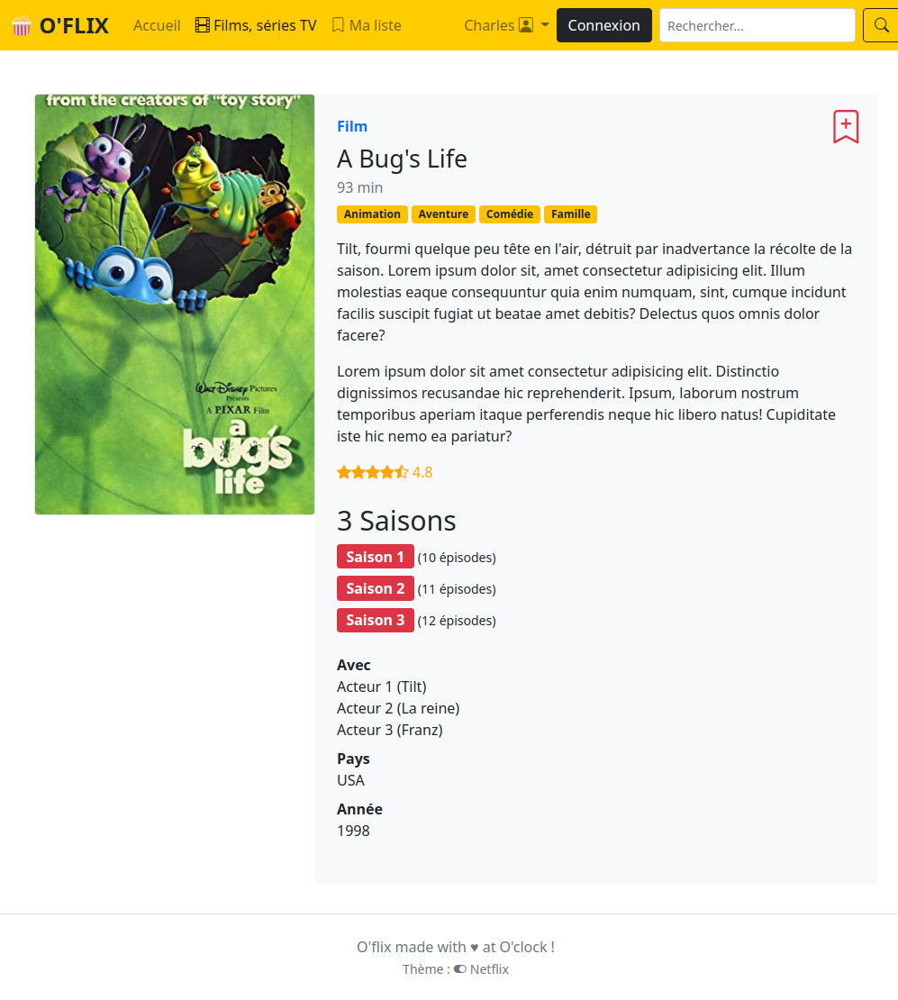
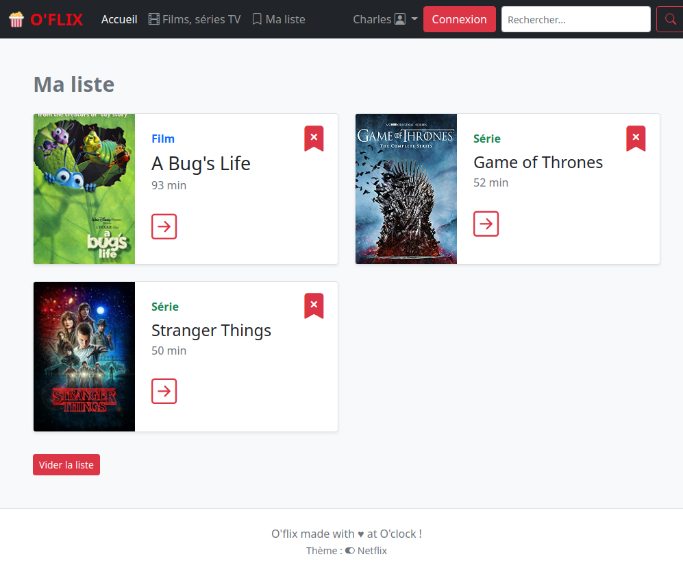
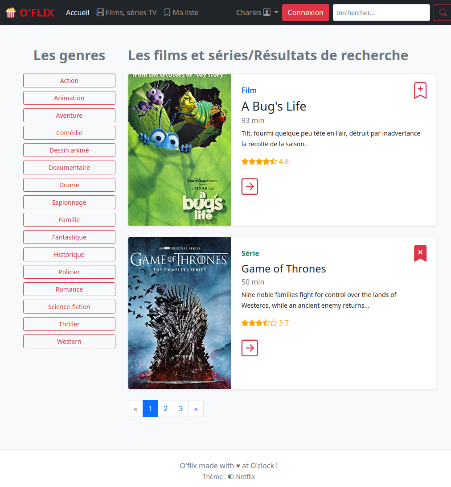

# Projet O'flix, Symfony Getting Started

Afin de prendre en main le framework Symfony, je vais mettre en place un site qui répertorie des films et des séries ! 

Voici quelques captures et contenus fournis, pour entrevoir les fonctionnalités attendues.

### 1. Page d'accueil

<kbd></kbd>

### 2. Page du film ou de la série

<kbd></kbd>

:warning: Vous noterez ici le **changement de couleur de la nav**. Je vais créer un _theme switcher_ (sélecteur de thème) pour choisir le thème Netflix ou Allociné (voir le bouton dans le pied de page).

### 3. Page des favoris utilisateur

<kbd></kbd>

### 4. Liste des films ou des Résultats de recherche

<kbd></kbd>
---

### Objectifs

- Installer _Symfony Skeleton_
- L'enrichir au besoin via la documentation de Symfony section _Getting Started_, à l'aide de ce README.
- Parcourir la documentation Twig (moteur de templating)
- Créer un site entre Allociné et Netflix.

[la documentation Symfony : Getting Started](https://symfony.com/doc/current/index.html).

**Installation**

Installer un nouveau projet Symfony _"skeleton"_, via _composer_, :
- `composer create-project symfony/skeleton oflix`

Vous pouvez :

- Conserver ce sous-dossier, entrez dans le dossier du projet avec `cd oflix`.
- Ou **plus propre** et nécessite une ligne de commande, remonter tous les fichiers de Symfony à la racine de votre dépôt cloné. `mv sous-dossier/* sous-dossier/.* .`

> :hand: On peut utiliser le serveur PHP pour lancer l'appli Symfony : `php -S 0.0.0.0:8000 -t public`.

> :hand: Ou passer par Apache, on installe le `.htaccess` via `composer require symfony/apache-pack` (répondre `y` à l'invite).
